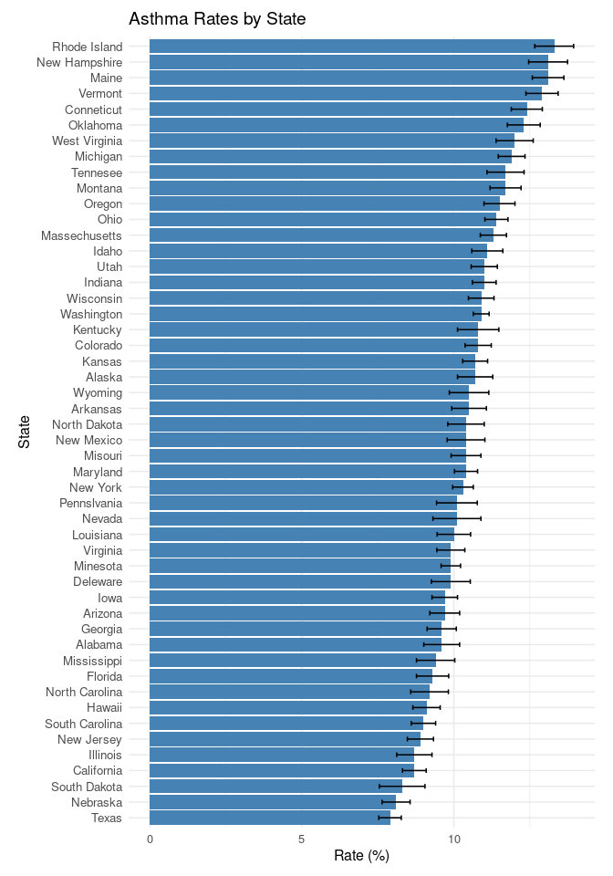

Final R Markdown Report: Asthma and Socioeconomic Factors
================
Emma Shumway
2025-11-18

- [ABSTRACT](#abstract)
- [BACKGROUND](#background)
- [STUDY QUESTION and HYPOTHESIS](#study-question-and-hypothesis)
  - [Question](#question)
  - [Hypothesis](#hypothesis)
  - [Prediction](#prediction)
- [METHODS](#methods)
  - [Analysis 1: Asthma and Poverty
    Level](#analysis-1-asthma-and-poverty-level)
  - [Analysis 2: Asthma and Sex](#analysis-2-asthma-and-sex)
  - [Analysis 3: Asthma and Age](#analysis-3-asthma-and-age)
- [DISCUSSION](#discussion)
  - [Interpretation - Analysis 1](#interpretation---analysis-1)
  - [Interpretation - Analysis 2](#interpretation---analysis-2)
  - [Interpretation - Analysis 3](#interpretation---analysis-3)
- [CONCLUSION](#conclusion)
- [REFERENCES](#references)

# ABSTRACT

This report \_\_\_\_\_.

# BACKGROUND

Asthma affects over 26 million people in the U.S. (Most Recent Asthma
Data, 2024). The development of asthma is not linked to any single
factor; rather, there have been a variety of genetic and environmental
factors known to be associated with asthma incidence (Khachi et al.,
2014). Effective treatment can only be provided through thorough study
of the underlying causal factors, so it is useful to examine available
data for trends. This report attempts to answer the question: how does
age, poverty level, and sex each influence an individual’s
susceptibility to asthma? It is hypothesized that there will be a
significant correlation between asthma and age, asthma and poverty
level, but not a very significant correlation between asthma and sex. If
each of these factors do influence an individual’s susceptibility to
asthma, this will result in a p-value of \<0.05 after running a t-test.

# STUDY QUESTION and HYPOTHESIS

## Question

How does age, poverty level, and sex each influence an individual’s
susceptibility to asthma?

## Hypothesis

There will be a significant correlation between asthma and age, asthma
and poverty level, but not a very significant correlation between asthma
and sex.

## Prediction

If each of these factors do influence an individual’s susceptibility to
asthma, this will result in a p-value of \<0.05 after running a t-test.

# METHODS

A t-test will test the significance of asthma being present given
certain factors.

\##Data for map Data for map

\##Box plot code

``` r
library(ggplot2)

ggplot(asthma_data, aes(x = region, y = prevalence)) +
  geom_boxplot() +
  labs(title = "Asthma Prevalence by U.S. Region",
       x = "Region",
       y = "Asthma Prevalence (%)") +
  theme_minimal()
```


Map

``` r
library(ggplot2)
library(maps)
library(dplyr)

# Map data
states_map <- map_data("state")

# Merge map data with asthma data
map_data <- states_map %>%
  left_join(asthma_data, by = c("region" = "state_lower"))

ggplot(map_data, aes(long, lat, group = group, fill = prevalence)) +
  geom_polygon(color = "gray90", size = 0.3) +  # state borders
  geom_polygon(aes(fill = prevalence), color = "white") +
  coord_fixed(1.3) +
 scale_fill_gradientn(
  name = "Asthma Prevalence (%)",
  colors = c("yellow2", "orange", "red", "red4")
) +
  labs(
    title = "Asthma Prevalence by U.S. State"
  ) +
  theme_void() +
  theme(
    legend.position = "right",
    plot.title = element_text(size = 16, face = "bold"),
    plot.subtitle = element_text(size = 12)
  )
```


## Analysis 1: Asthma and Poverty Level

``` r
library(ggplot2)

ggplot(asthma_data, aes(x = region, y = prevalence)) +
  geom_boxplot() +
  labs(title = "Asthma Prevalence by U.S. Region",
       x = "Region",
       y = "Asthma Prevalence (%)") +
  theme_minimal()
```


This map shows how the regions were split up

Scatter Plot Code

``` r
ggplot(asthma_data, aes(x = population, y = prevalence)) +
  geom_point(aes(color=region)) +
  geom_text(aes(label = state_abrv), vjust = -0.5, size = 3)+
  labs(title = "Number of Individuals With Asthma vs. Asthma Prevalence by State",
       x = "Population",
       y = "Asthma Prevalence (%)") +
  theme_minimal()
```


## Analysis 2: Asthma and Sex

## Analysis 3: Asthma and Age

``` r
library(ggplot2)

age <- data.frame(
  category = c(" 0-4", " 5-11", "12-17", "18-24", "25-34", "35-64", "65+"),
  value = c(1.4, 2.4, 2.0, 3.8, 6.4, 11.5, 27.1)
)

ggplot(age, aes(x = category, y = value)) +
  geom_bar(stat = "identity", fill = "darkred") +
  labs(
    title = "Asthma Deaths By Age Group",
    x = "Age (Years)",
    y = "Asthma-Related Deaths Per Million",
    caption = "Figure 1. Asthma-related deaths in 2021 occurring by age group per million as reported by the CDC."
  ) +
  scale_y_continuous(
    breaks = seq(0, 30, by = 2),  # show numbers every 2 units 
    minor_breaks = seq(0, 30, by = 1)  # add smaller grid lines between major ones
  )
```

<!-- -->

Bar Plot showing prevalence per state PART 2 NOAH

<!-- -->
\##ANOVA Test install.packages(“tidyverse”) install.packages(“readxl”)
install.packages(“car”) install.packages(“lme4”)
install.packages(“emmeans”) install.packages(“ggplot2”)

``` r
# --- Load required packages (must already be installed) ---
library(tidyverse)   # data wrangling and ggplot2
library(readxl)      # reading Excel files
library(car)         # ANOVA tests
library(lme4)        # linear and mixed models
library(emmeans)     # estimated marginal means
library(ggplot2)     # graphics

# 1. First, we create a simple linear model. We name the model m1.
m1 <- lm(prevalence ~ pop_density_sqmile, data=asthma_data) # here, my response (dependent) variable is prevalence, and the predictor (independent) variable is population density. In words, this model is asking, "does the data in column pop_density_sqmile explain variance in column prevalence, within the dataset called asthma_data?".

# 2. Next, we conduct our statistical test: an analysis of variance.
Anova(m1) # This tells us whether there is a significant effect of population density on asthma prevalence, and provides us the ingredients for our statistical reporting. Cool!
```

    ## Anova Table (Type II tests)
    ## 
    ## Response: prevalence
    ##                    Sum Sq Df F value Pr(>F)
    ## pop_density_sqmile  0.343  1  0.1877 0.6668
    ## Residuals          87.694 48

``` r
summary(m1) # This gives other important ingredients to report from our statistics, such as the amount of variance explained by our independent variable; the degrees of freedom; and our test statistic. The important information to report is at the bottom of this output.
```

    ## 
    ## Call:
    ## lm(formula = prevalence ~ pop_density_sqmile, data = asthma_data)
    ## 
    ## Residuals:
    ##     Min      1Q  Median      3Q     Max 
    ## -2.5804 -0.8478 -0.0491  0.6314  2.6415 
    ## 
    ## Coefficients:
    ##                     Estimate Std. Error t value Pr(>|t|)    
    ## (Intercept)        1.044e+01  2.404e-01  43.446   <2e-16 ***
    ## pop_density_sqmile 3.042e-04  7.022e-04   0.433    0.667    
    ## ---
    ## Signif. codes:  0 '***' 0.001 '**' 0.01 '*' 0.05 '.' 0.1 ' ' 1
    ## 
    ## Residual standard error: 1.352 on 48 degrees of freedom
    ## Multiple R-squared:  0.003894,   Adjusted R-squared:  -0.01686 
    ## F-statistic: 0.1877 on 1 and 48 DF,  p-value: 0.6668

# DISCUSSION

## Interpretation - Analysis 1

Insert analysis here.

## Interpretation - Analysis 2

Insert analysis here.

## Interpretation - Analysis 3

Insert analysis here.

# CONCLUSION

The data suggests that \_\_\_\_.

# REFERENCES

1.  Khachi, H., Meynell, H., & Murphy, A. (2014). Asthma:
    Pathophysiology, causes and diagnosis. The Pharmaceutical Journal.
    <https://pharmaceutical-journal.com/article/ld/asthma-pathophysiology-causes-and-diagnosis>

2.  Most Recent Asthma Data. (2024, November 21). CDC.
    <https://www.cdc.gov/asthma-data/about/most-recent-asthma-data.html>
